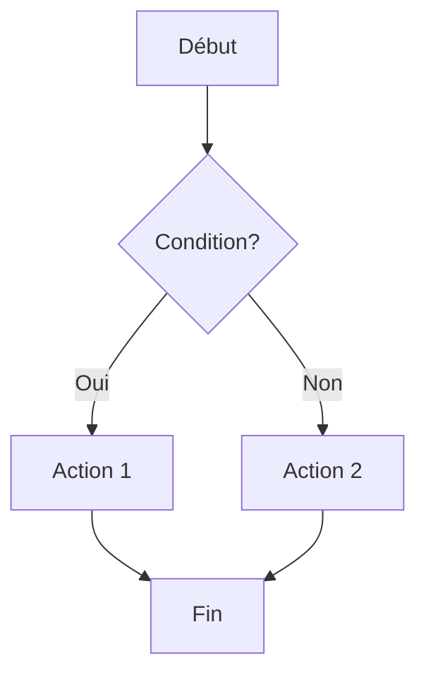
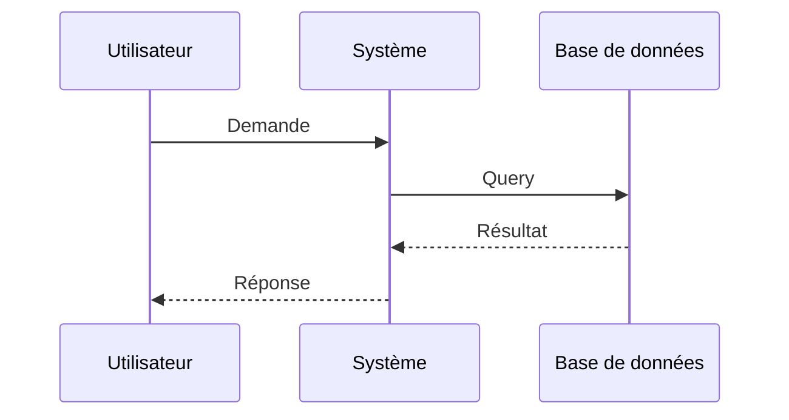

# Guide complet du Markdown

Ce document présente l'ensemble des fonctionnalités Markdown pour tester et exploiter pleinement votre viewer.

## Titres et hiérarchie

Les titres permettent de structurer votre document en sections hiérarchiques.

# Titre de niveau 1
## Titre de niveau 2
### Titre de niveau 3
#### Titre de niveau 4
##### Titre de niveau 5
###### Titre de niveau 6

---

## Emphase et formatage de texte

Le Markdown offre plusieurs options pour mettre en valeur le texte :

- **Texte en gras** avec `**texte**` ou `__texte__`
- *Texte en italique* avec `*texte*` ou `_texte_`
- ***Texte en gras et italique*** avec `***texte***`
- ~~Texte barré~~ avec `~~texte~~`
- `Code inline` avec des backticks simples
- Texte normal pour comparaison

---

## Listes

### Listes non ordonnées

- Premier élément
- Deuxième élément
  - Sous-élément indenté
  - Autre sous-élément
    - Sous-sous-élément
- Troisième élément

### Listes ordonnées

1. Premier élément
2. Deuxième élément
   1. Sous-élément numéroté
   2. Autre sous-élément
3. Troisième élément

### Listes de tâches

- [x] Tâche terminée
- [x] Autre tâche complétée
- [ ] Tâche en cours
- [ ] Tâche à faire

---

## Liens et références

Les liens peuvent être intégrés de plusieurs façons :

- Lien simple : [Texte du lien](https://example.com)
- Lien avec titre : [Texte du lien](https://example.com "Titre au survol")
- Lien de référence : [Texte du lien][ref]
- URL directe : <https://example.com>
- Email : <email@example.com>

[ref]: https://example.com "Lien de référence"

---

## Images

Les images fonctionnent comme les liens avec un point d'exclamation devant :


Image avec titre au survol :


---

## Blocs de code

### Code inline

Utilisez `const variable = "valeur"` pour du code dans le texte.

### Blocs de code avec coloration syntaxique

```javascript
// Exemple JavaScript
function fibonacci(n) {
  if (n <= 1) return n;
  return fibonacci(n - 1) + fibonacci(n - 2);
}

const result = fibonacci(10);
console.log(`Fibonacci(10) = ${result}`);
```

```python
# Exemple Python
def factorial(n):
    if n <= 1:
        return 1
    return n * factorial(n - 1)

print(f"Factoriel de 5 = {factorial(5)}")
```

```css
/* Exemple CSS */
.container {
  display: flex;
  justify-content: center;
  align-items: center;
  background: linear-gradient(135deg, #667eea 0%, #764ba2 100%);
  border-radius: 8px;
  padding: 2rem;
}
```

---

## Citations

Les citations se créent avec le symbole `>` :

> Ceci est une citation simple.
> Elle peut s'étendre sur plusieurs lignes.

Les citations peuvent être imbriquées :

> Citation de niveau 1
>
> > Citation imbriquée de niveau 2
> >
> > > Citation imbriquée de niveau 3

> **Citation avec formatage**
>
> On peut utiliser *tous* les éléments **Markdown** dans une citation :
>
> - Listes
> - `Code`
> - Et plus encore

---

## Séparateurs horizontaux

Les séparateurs se créent avec trois tirets, astérisques ou underscores :

---

***

___

---

## Tableaux

Les tableaux permettent d'organiser des données structurées :

| Colonne 1 | Colonne 2 | Colonne 3 |
|-----------|-----------|-----------|
| Ligne 1   | Donnée A  | Donnée B  |
| Ligne 2   | Donnée C  | Donnée D  |
| Ligne 3   | Donnée E  | Donnée F  |

### Alignement dans les tableaux

| Gauche | Centre | Droite |
|:-------|:------:|-------:|
| A      | B      | C      |
| Texte long à gauche | Centré | 123 |
| D      | E      | 456 |

### Tableau complexe

| Fonctionnalité | Support | Priorité | Notes |
|:---------------|:-------:|---------:|:------|
| Headers | ✓ | Haute | Complètement implémenté |
| Inline code | ✓ | Haute | Fonctionne bien |
| Tables | ✓ | Moyenne | Support basique |
| Images | ✓ | Moyenne | À améliorer |

---

## Échappement de caractères

Pour afficher des caractères spéciaux Markdown, utilisez le backslash `\` :

- \*Texte non en italique\*
- \[Pas un lien\](url)
- \`Pas du code\`
- \# Pas un titre

---

## HTML intégré

Certains viewers supportent du HTML intégré :

<div style="background: #f0f0f0; padding: 1rem; border-left: 4px solid #4A90E2;">
  <strong>Note :</strong> Ceci est un bloc HTML personnalisé.
</div>

<details>
<summary>Élément repliable (cliquez pour déplier)</summary>

Contenu caché qui apparaît quand on déplie.

- Peut contenir du Markdown
- **Y compris du formatage**
- Et d'autres éléments

</details>

---

## Notes de bas de page

Voici un texte avec une note de bas de page[^1].

On peut aussi utiliser des notes nommées[^note-importante].

[^1]: Ceci est la première note de bas de page.
[^note-importante]: Ceci est une note importante avec un identifiant descriptif.

---

## Formules mathématiques

Si votre viewer supporte LaTeX/KaTeX :

Inline : $E = mc^2$

Bloc :

$$
\int_{-\infty}^{\infty} e^{-x^2} dx = \sqrt{\pi}
$$

$$
f(x) = \frac{1}{\sigma\sqrt{2\pi}} e^{-\frac{1}{2}\left(\frac{x-\mu}{\sigma}\right)^2}
$$

---

## Diagrammes Mermaid

Si votre viewer supporte Mermaid :





---

## Émojis

Si supportés par votre viewer :

- 👍 :+1:
- 🎉 :tada:
- 🚀 :rocket:
- ⚠️ :warning:
- ✅ :white_check_mark:
- ❌ :x:

---

## Pistes d'amélioration pour votre viewer

### Fonctionnalités prioritaires

1. **Coloration syntaxique avancée**
   - Support de plus de langages
   - Thèmes personnalisables (clair/sombre)
   - Numérotation des lignes

2. **Tables améliorées**
   - Tri des colonnes
   - Recherche dans les tableaux
   - Export CSV/JSON
   - Cellules fusionnées

3. **Mode présentation**
   - Navigation entre sections
   - Mode plein écran
   - Progression visuelle

### Fonctionnalités secondaires

4. **Table des matières automatique**
   - Générée à partir des titres
   - Navigation rapide
   - Repliable/dépliable

5. **Export avancé**
   - PDF avec mise en forme
   - HTML standalone
   - Impression optimisée

6. **Annotations et commentaires**
   - Surlignage de texte
   - Notes personnelles
   - Partage d'annotations

### Améliorations UX

7. **Performance**
   - Rendu virtuel pour longs documents
   - Lazy loading des images
   - Mise en cache intelligente

8. **Accessibilité**
   - Support lecteur d'écran
   - Navigation au clavier complète
   - Contraste personnalisable
   - Taille de police ajustable

9. **Collaboration**
   - Mode diff pour comparer versions
   - Commentaires collaboratifs
   - Historique des modifications

### Intégrations

10. **Plugins et extensions**
    - API pour extensions tierces
    - Support de nouveaux formats
    - Intégration avec outils externes

---

## Tests de cas limites

### Texte très long sans espaces

Supercalifragilisticexpialidociousanticonstitutionnellementpneumonoultramicroscopicsilicovolcanoconiosisextraordinairement

### Listes profondément imbriquées

- Niveau 1
  - Niveau 2
    - Niveau 3
      - Niveau 4
        - Niveau 5
          - Niveau 6

### Code avec caractères spéciaux

```javascript
const regex = /[.*+?^${}()|[\]\\]/g;
const special = "Tests: <>&\"'`";
const unicode = "🔥 Émojis 中文 العربية";
```

### Tableau avec beaucoup de colonnes

| Col1 | Col2 | Col3 | Col4 | Col5 | Col6 | Col7 | Col8 |
|------|------|------|------|------|------|------|------|
| A    | B    | C    | D    | E    | F    | G    | H    |

---

## Conclusion

Ce document teste l'ensemble des fonctionnalités Markdown courantes. Utilisez-le pour évaluer les capacités de votre viewer et identifier les domaines d'amélioration.

**Version:** 1.0  
**Dernière mise à jour:** Décembre 2024  
**Auteur:** Claude (Anthropic)